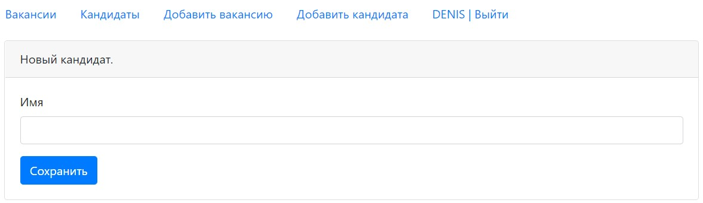

## Dream Job

### О проекте
Проект по изучению сервлетов.
### Technologies
* Java 14
* Java EE Servlets
* Apache Tomcat
* Postgres
* JS, AJAX, JSP, HTML (front)
* Logging system Slf4j with log4j
* Mockito with PowerMock for test cases
* Maven as a build system
### Возможности
* Авторизация/регистрация. Учетные данные хранятся в БД. Без авторизации ограничен доступ к некоторым страницам с помощью фильтра. При успешной аутентификации имя пользователя сохраняется в сессии.
* Создание/редактирование кандидатов. Загрузка изображений. Данные по кандидатам хранятся в БД. Картинки хранятся в Tomcat.
### Demo
Login page

Registration page

Candidates list

Candidate creating page

Candidate editing page

